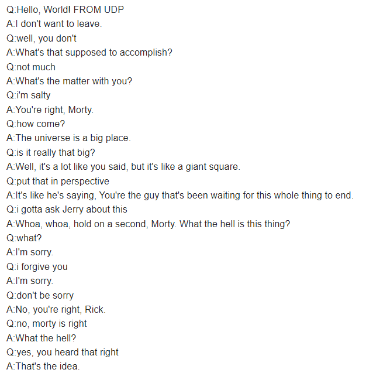

# PR-Lab2
Lab 2 for network programming course at university

# Prerequesites
Create a .env file inside the root folder of the repository, that contains your google user login and password information. An example of the .env file is ".env.txt"

Make sure to enable "Allow less secure apps" in your google account settings, so that this app can log in to your account to send emails via smtp.

# 100% check
The program's protocols did not change after the 70% submission.
This check is about the chatbot itself.

This chatbot is using the microsoft's dialogpt, which is an open source transformer model trained on dialogs.
This transformer can be fine tuned. I fine tuned it using the kaggle rick and morty dialog dataset.
The model that i trained is not included in the repository. You can tune it yourself if you want to.

Features:
1) Uses multiple clients with different protocols.
2) Each client has a personal chat history.
3) You can email the chat history to a email.

Example of fine-tuned chatbot chat history that was emailed to one of my accounts.

Example of chat history without fine-tuning.

# 70% check
The program has is using 6 protocols. TCP, UDP, HTTP, and FTP are used for communication to the chatbot server.
Each of these four protocols have a different client.

You type 'email receiver@gmail.com' to email the chat history to the specified receiver email.
Email is sent with the help of the SSL and SMTP protocols. SSL is used to make a ssl context that the smtp uses when sending an email.
SSL context is used because i couldn't use smtp without it.
# 40% check
The program is using 3 protocols to transmit a message to the 3 corresponding servers from the chat.
The chat is currently only answering with received_message+"THIS IS THE RESPONSE".
The used protocols are TCP, UDP, HTTP

Run chat.py file to start the chat servers.  

Run each client file to send one "Hello, World! FROM X " message. Check the chat console to see what it received and from where.
